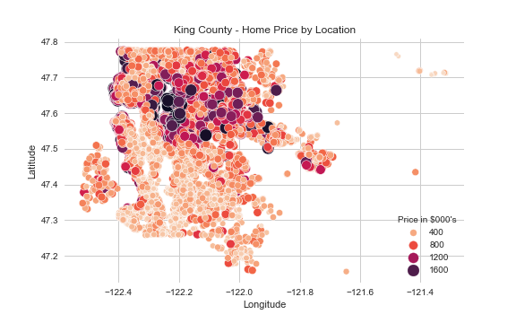

# Housing Price Linear Regression Analysis


<a href='https://www.freepik.com/vectors/sale'>Sale vector created by pch.vector - www.freepik.com</a>

**Author**: Samantha Knee

## Overview

This project is an analysis of housing prices in King County, WA, intended to provide insights to a real estate firm helping home sellers achieve the highest selling price. Regression analysis showed that the amount of times a house is viewed, the number of bathrooms in the house and the condition of the house is highly correlated with the house’s price. The real estate firm’s clients can use this information to drive the highest price possible in their current house.

***

## Business Problem

ABC Realty is looking to become more competitive in the highly saturated King County, WA real estate market. The Company needs a model that accurately determines housing prices, so that their realtor’s can provide the best insight to sellers on what can increase the value of a home. This model will serve as a competitive advantage for ABC Realty, so they can attract more home sellers to use the Company’s service. ABC's clients are young, price sensitive individuals looking to achieve the highest selling price possible. The questions answered in this analysis include:

* How much does the condition of a home affect sale price?
* How does number of bathrooms affect sale price?
* How does the number of views on a house affect sale price?

Answers to these questions can provide concrete recommendations to sellers in regards to if it is worth changing aspects of their current house, or if the expenses required to remodel outweigh the benefit of an increase in price.

***

## Data

The dataset used contains home sale prices for King County, WA between May 2014 and May 2015. It includes details about characteristics of the house including number of bedrooms, number of bathrooms, square footage of the lot, living room, and above ground square footage. It also includes location data such as latitude and longitude coordinates as well as zipcode. It includes a condition rating on a scale of 1-5 and a grade rating on a scale of 1-10. The dependent variable throughout the analysis is price.


***

## Methods

This project used linear regression to define the relationship between sale price and the independent variables. Categorical variables were changed into dummy variables. Certain variables that were not found to have a statistically significant impact on price were dropped. Sale prices over $2 million were removed from the data set. Features with high multicollinearity among other features were also removed. Transformations were also performed on the dependent variable in order to meet the assumption of residual normality.

***

## Results

There is a statistically significant relationship with price and 26 independent variables. The variables described below have both a strong relationship with price in the final model and are actionable items that have the potential to be changed in a given house.

A house that is viewed 4 times has a 34% higher price compared with houses viewed 0 times. A house viewed 3 times has a 21% higher price than 0 views, holding all else equal.


Houses with 3-4 (inclusive of 4) bathrooms have a price 9% higher than homes with 1 bathroom. Houses with 2-3 (inclusive of 3) bathrooms have a 6% higher price on average.


Houses with condition of 5 out of 5 have an 18.6% higher price on average than homes with condition of 1. Houses with conditions 4 out of 5 have 10% higher price on average.


***


## Conclusions

* **Sellers should use open houses to increase the number of views on their house.** This is a simple, affordable way to potentially lead to a higher price. Houses viewed 4 times have a price 34% higher on average, and a house viewed 3 times has a 16% higher price on average.

* **It may make sense for some sellers to make a renovation to the home increasing the number of bathrooms.** For example, if a house is worth $500k with 1 bathroom, increasing to 3 bathrooms could increase price by $30,000, and increasing to 4 bathrooms could increase price by $45,000. If it costs less than $30,000 to add 2 bathrooms to the home, it will be likely worth completing that renovation for market value.

* **Sellers should try to increase the condition of their home to a 4 or 5 if possible.** Having a 4 condition home appears to boost price by 9.8%, while condition 5 increases price by 18.6%. The sellers could make updates to the home such as upgrading fixtures and appliances and painting, as long as they keep their budget below ~10% of the home's current value.


## Next Steps

* **Run a similar analysis for buyers of homes.** It would be interesting to discover what aspects of a home buyers should look for to get the lowest price possible. For example, we already discovered in the model that homes in quadrant 4 are 37% lower in price on average than homes in quadrant 1. In the future, we would like to explore this information further and build a model with the buyer of homes in mind.

* **Further investigate the relationship between bedrooms and price.** In our initial data exploration, it appeared there was a positive correlation between bedrooms and price, however, after binning the # of bedrooms variables, many of the bins were dropped as variables for being statistically insignificant, and the bedroom variable remaining (6+ bedrooms) has a negative relationship with price. This needs some further investigation, and in the future we may consider using a subset of houses with a smaller range of # of bedrooms, such as 3-5, and see what the relationship is in that scenario.


## For More Information

Please review the EDA in this [Jupyter Notebook](./Housing%20Data%20-%20EDA.ipynb), thefull modeling analysis in this [Jupyter Notebook](./Housing%20Data%20-%20Modeling.ipynb), and this [presentation](./House_Price_Analysis_Presentation.pdf).

For any additional questions, please contact **Samantha Knee at samanthaknee24@gmail.com**


## Repository Structure


```
├── README.md                                 <- The top-level README for reviewers of this project
├── Housing_Data-EDA.ipynb                    <- Narrative documentation of data cleaning in Jupyter notebook
├── Housing_Data-Modeling.ipynb               <- Narrative documentation of analysis in Jupyter notebook
├── House_Price_Analysis_Presentation.pdf     <- PDF version of project presentation
├── data                                      <- Both sourced externally and generated from code
└── images                                    <- Both sourced externally and generated from code
```
